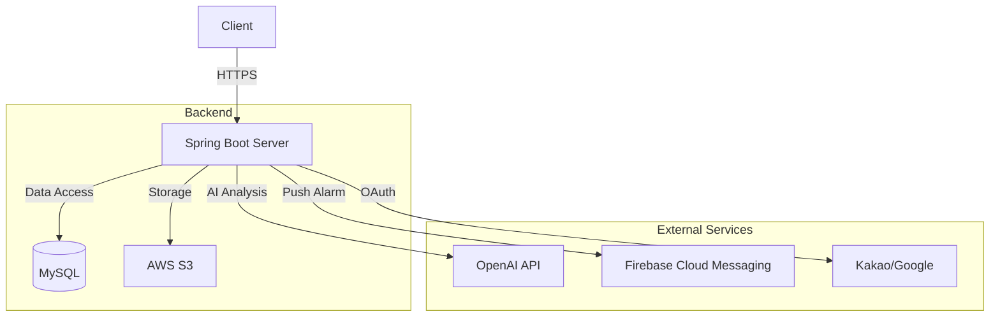

# FILLIN (필인) SERVER

**도로 위의 빈틈을 함께 채우는 실시간 도로 상황 제보 플랫폼 ‘FILLIN’**의 백엔드 서버입니다.

server : https://api.fillin.site

## 📖 프로젝트 소개

**FILLIN**은 단순히 정보를 공유하는 것을 넘어, **AI 분석을 통한 데이터 신뢰성 확보**와 **사용자 참여 유도(게이미피케이션)**를 결합한 서비스입니다. 시민들의 자발적인 제보가 모여 더욱 안전한 도로를 만듭니다.

### 🔄 제보 프로세스 (Core Flow)

1. **제보 등록 (Report)**: 사용자가 도로의 위험 상황을 촬영하여 위치 정보와 함께 업로드합니다.
2. **AI 상황 분석 (Analysis)**: 업로드된 이미지를 **AI(OpenAI)**가 분석하여 위험 카테고리를 자동 분류하고 적절한 라벨을 생성합니다.
3. **실시간 공유 & 피드백**: 제보된 내용은 지도 위에 실시간으로 노출되며, 다른 유저들이 '아직 위험해요' 또는 '해결됐어요' 피드백을 남겨 정보의 최신성을 유지합니다.
4. **보상 및 성장 (Reward)**: 유효한 제보 활동에 따라 등급 승격 및 업적 달성을 통해 게이미피케이션 요소를 제공합니다.

## 🛠️ Tech Stack

| Category | Stack |
| --- | --- |
| **Language** | Java 17 |
| **Framework** | Spring Boot 3.4.1 |
| **ORM / DB** | Spring Data JPA, MySQL |
| **Auth / Security** | Spring Security, JWT (Access/Refresh Token) |
| **Infra / Storage** | AWS S3, EC2, RDS |
| **AI / LLM** | OpenAI API (Report Tagging & Analysis) |
| **Mail / Noti** | Firebase Cloud Messaging (FCM) |
| **Build / Deploy** | Gradle, Docker, GitHub Actions |
| **Etc** | Lombok, Swagger (SpringDoc), QueryDSL |

## ✨ Key Features

### 1. AI 기반 스마트 제보 시스템

* **실시간 이미지 분석**: 제보 사진 업로드 시 `ReportAnalysisService`를 통해 상황을 자동 분류(포트홀, 공사 중 등)하고 위험도를 평가합니다.
* **위치 기반 필터링**: 사용자의 현재 위치를 중심으로 주변의 위험 요소들을 빠르게 조회할 수 있습니다.

### 2. 리얼타임 알림 및 피드백

* **FCM 푸시 알림**: 내가 제보한 지역 근처의 새로운 정보나, 내 제보에 대한 피드백(좋아요 등)이 발생하면 실시간으로 알림을 전송합니다.

### 3. 게이미피케이션 (MyPage & Rank)

* **활동 기반 등급 시스템**: 활동량에 따라 **탐험가(Tamheomga)**, **해결사(Haegyeolsa)**, **보안관(Boangwan)**으로 등급이 승격됩니다.
* **업적(Achievement) 시스템**: 특정 횟수 이상의 제보나 피드백을 달성하면 뱃지를 획득할 수 있습니다.

### 4. 운영 및 관리 자동화

* **제보 데이터 스케줄링**: `ReportScheduler`를 통해 일정 시간이 지난 제보의 상태를 자동으로 관리하거나 만료된 데이터를 정리합니다.
* **이미지 최적화**: AWS S3를 연동하여 대용량의 제보 사진을 안정적으로 관리합니다.

## 🔍 상세 기능 명세

### 🔐 인증 및 유저 관리

* **소셜 로그인** → 카카오, 구글 OAuth2 연동 
* **토큰 관리** → JWT 기반 인증 및 Refresh 토큰을 통한 세션 유지
* **프로필 관리** → 유저 등급, 경험치, 닉네임 수정, 미션 진행도 확인

### 📍 제보 및 분석 (Report)

* **제보 생성** → 이미지 및 위치 데이터 제출 
* **AI 라벨링** → OpenAI API를 활용한 제보 내용 자동 태깅 및 분석
* **인기 제보** → 좋아요와 조회수가 높은 실시간 핫한 제보 노출

### 🔔 알림 및 설정 (Alarm & Noti)

* **맞춤 알림 설정** → 알림 타입별(활동, 마케팅 등) 수신 여부 설정 수정
* **실시간 푸시** → FCM을 활용한 디바이스 알림 전송

### 🏆 마이페이지 및 랭킹

* **내 제보 관리** → 내가 올린 제보들(유지/만료) 확인
* **업적 조회** → 획득한 업적 조회

## 🏛️ System Architecture




## 📂 Project Structure

```bash
com.fillin
├── controller      # API 엔드포인트 (Report, Member, Mypage, Alarm 등)
├── service         # 비즈니스 로직 (AI 분석, 랭킹 시스템, S3 연동)
├── repository      # DB 접근 계층 (Spring Data JPA)
├── domain          # 엔티티 및 Enum (Report, Member, Alarm, Rank...)
├── dto             # Request/Response 데이터 전송 객체
├── converter       # 엔티티-DTO 변환 로직
├── infrastructure  # 외부 서비스 연동 (FCM, OpenAI)
└── global
    ├── config      # Security, S3, Firebase, Swagger 설정
    ├── apiPayload  # 공통 응답 처리 (Response, ErrorCode)
    └── security    # JWT 및 인증 필터

```

## 🚀 Deployment Pipeline

**GitHub Actions**와 **Docker**를 활용하여 지속적 통합 및 배포를 수행합니다.

1. **Code Push**: `main` 또는 `develop` 브랜치 병합
2. **Build**: Gradle을 이용한 프로젝트 빌드 및 Docker 이미지 생성
3. **Push**: Docker Hub 또는 AWS ECR에 이미지 업로드
4. **Deploy**: AWS EC2에서 `docker-compose`를 통해 컨테이너 갱신 및 Nginx 무중단 배포


